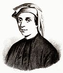
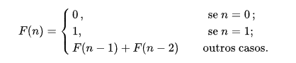

# Propósito
Eficiência de código. Meus exemplos sobre eficiência de código. Utilizando a sequência de fibonacci como exemplo de crescimento exponencial na utilização de recursos. Implementei e testei algumas possibilidades para geração da famosa sequência de números, não descoberta, mas sim popularizada pelo matmático italiano Leonardo Fibonacci em seu livro denominado o Liber Abaci (Livro do Ábaco ou Livro de Cálculo), em 1202 (atualizado em 1254).

# A sequência de Fibonacci

A Sequência de Fibonacci consiste em uma sucessão de números, tais que, definindo os dois primeiros números da sequência como 0 e 1, os números seguintes serão obtidos por meio da soma dos seus dois antecessores. Portanto, os números são: 0,1,1,2,3,5,8,13,21,34,55,89,144,233,377,610,987,1597,2584,4181...

Se nós dividirmos a base pela altura de um retângulo áureo, extrai-se a razão que é um "número irracional algébrico" conhecido como número de ouro, denotado com o símbolo "φ".

A sequência de Fibonacci é dada pela fórmula:

