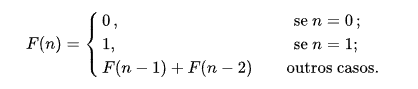
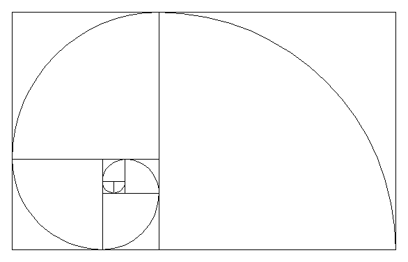
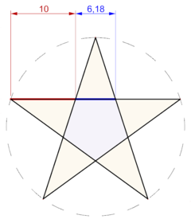
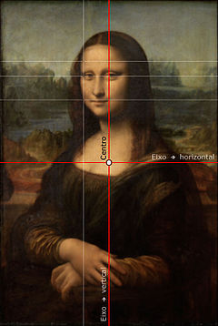
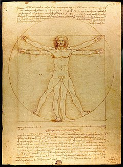

# Propósito
Eficiência de código. Meus exemplos sobre eficiência de código. Utilizando a sequência de fibonacci como exemplo de crescimento exponencial na utilização de recursos. Implementei e testei algumas possibilidades para geração da famosa sequência de números, não descoberta, mas sim popularizada pelo matmático italiano Leonardo Fibonacci em seu livro denominado o Liber Abaci (Livro do Ábaco ou Livro de Cálculo), em 1202 (atualizado em 1254).

# A Sequência de Fibonacci

A sequência de Fibonacci é dada pela fórmula:

 

A Sequência de Fibonacci consiste em uma sucessão de números, tais que, definindo os dois primeiros números da sequência como 0 e 1, os números seguintes serão obtidos por meio da soma dos seus dois antecessores. Portanto, os números são: 0,1,1,2,3,5,8,13,21,34,55,89,144,233,377,610,987,1597,2584,4181...

# O Número de Ouro

Se nós dividirmos a base pela altura de um retângulo áureo, extrai-se a razão que é um "número irracional algébrico" conhecido como número de ouro, denotado com o símbolo "φ" (PHI), em homenagem ao escultor Phideas (Fídias), que a teria utilizado para conceber o Parthenon, e com o valor arredondado a três casas decimais de 1,618. 

Desde a Antiguidade, a proporção áurea é usada na arte.[9] É frequente a sua utilização em pinturas renascentistas, como as do mestre Giotto. Este número está envolvido com a natureza do crescimento. Phi (não confundir com o número Pi), como é chamado o número de ouro, pode ser encontrado de forma aproximada no homem (o tamanho das falanges, ossos dos dedos, por exemplo), nas colmeias, entre inúmeros outros exemplos que envolvem a ordem de crescimento na natureza.

Justamente por ser encontrado em estudos de crescimento, o número de ouro ganhou um status de "ideal", sendo alvo de pesquisadores, artistas e escritores. O fato de ser apoiado pela matemática é que o torna fascinante.

# Estrela

Segmentos do pentagrama estão na proporção áurea, como mostra a figura. O pentagrama é obtido traçando-se as diagonais de um pentágono regular. O pentágono menor, formado pelas interseções das diagonais, está em proporção com o pentágono maior, de onde se originou o pentagrama. A razão entre as medidas dos lados dos dois pentágonos é igual ao quadrado da razão áurea.

# Arte
A Mona Lisa, de Leonardo da Vinci, tem a proporção áurea nas relações entre o tronco e a cabeça, bem como nos elementos da face, mas isso é uma característica inerente ao ser humano e tais proporções podem ser encontradas na maioria das pinturas em que a anatomia tenha sido respeitada. Medições feitas por computador mostraram que os olhos de Mona Lisa estão situados em subdivisões áureas da tela.

# Homem Virtuviano
O Homem Vitruviano, de Leonardo da Vinci. As ideias de proporção e simetria aplicadas à concepção da beleza humana.

